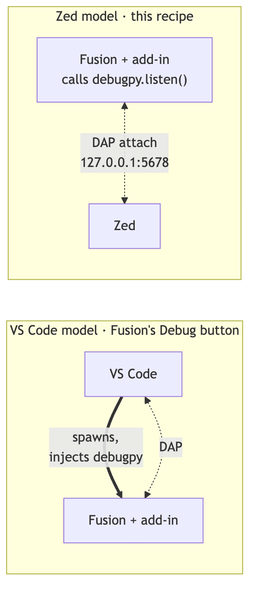
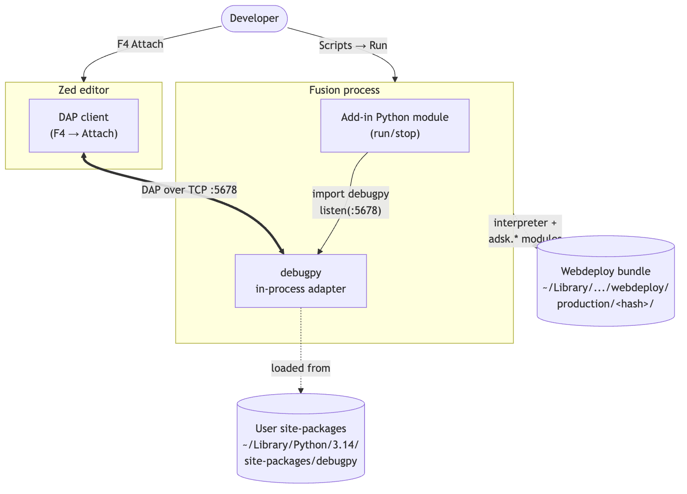
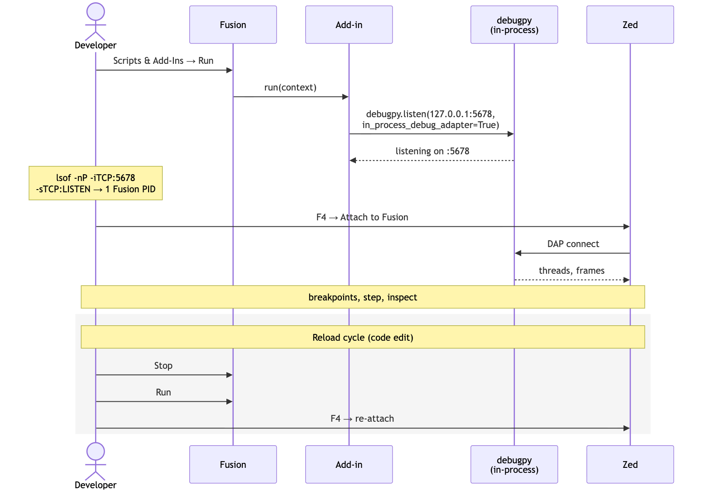
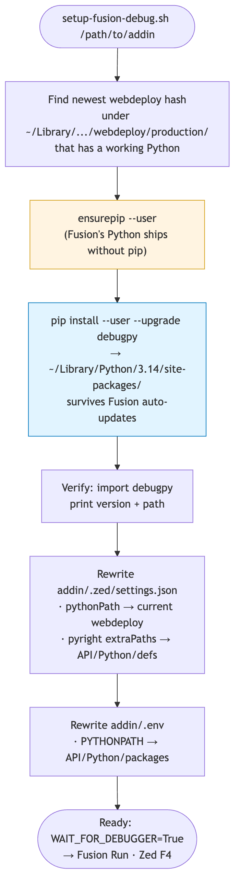
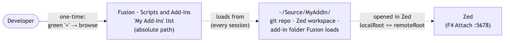

# Zed Debug for Autodesk Fusion Python add-ins

Make **Zed** your debugger for Fusion Python add-ins on macOS.
Fusion's **Debug** button in *Scripts and Add-Ins* is hardcoded to
launch VS Code, and the `ms-python.python` extension injects `debugpy`
for you. To use Zed (or any DAP client) you have to invert the model:
the add-in starts a `debugpy` server in-process, and the editor
attaches.



This repo contains the recipe, two helper scripts, and the four
non-obvious traps that we hit during setup. Apply it to any Fusion
add-in template — typical add-ins from Fusion's "New Add-In" generator
work without modification beyond the small `run()` patch that
`scripts/zed-enable-addin.sh` prints.

### System view



Repo: [`schneik80/Zed_Debug`](https://github.com/schneik80/Zed_Debug) on GitHub.

Scripts:

- [`scripts/setup-fusion-debug.sh`](https://github.com/schneik80/Zed_Debug/blob/main/scripts/setup-fusion-debug.sh) — finds the current Fusion Python, installs `debugpy`, regenerates per-addin `.zed/settings.json` + `.env`.
- [`scripts/zed-enable-addin.sh`](https://github.com/schneik80/Zed_Debug/blob/main/scripts/zed-enable-addin.sh) — applies the recipe to a specific add-in folder (anywhere on disk), writes `.zed/debug.json`, prints the `run()` patch.

Assumed layout:

```
~/Source/Zed_Debug/                 # this repo
  README.md                         # what you're reading
  scripts/
    setup-fusion-debug.sh
    zed-enable-addin.sh
```

Throughout this doc, `~/Source/Zed_Debug/scripts/...` is the invocation
path; adjust if you cloned the repo elsewhere.

---

## TL;DR per-session workflow

1. In `config.py`, set `WAIT_FOR_DEBUGGER = True`.
2. In Fusion → **Scripts and Add-Ins** → select the add-in → **Run**
   (*not* Debug — Debug forces VS Code).
3. Verify: `lsof -nP -iTCP:5678 -sTCP:LISTEN` shows exactly one Fusion PID.
4. In Zed: **F4** → **Attach to Fusion**.



To reload after a code edit: Scripts and Add-Ins → **Stop**, then **Run**,
then re-attach in Zed. Python module caching means a fresh attach is
required; you cannot simply continue.

To ship: set `WAIT_FOR_DEBUGGER = False`. The `debugpy` import is gated
and skipped entirely.

---

## One-time setup (and after every Fusion update)

Run the script against the add-in you want to enable:

```bash
~/Source/Zed_Debug/scripts/setup-fusion-debug.sh /path/to/addin
```

(The script accepts a no-arg form that defaults to its own parent dir —
useful when the script ships *inside* an add-in folder, but in this
standalone repo you always want to pass an explicit path.)

The script is idempotent. It:

1. Locates the **currently-installed** Fusion Python under
   `~/Library/Application Support/Autodesk/webdeploy/production/<hash>/Autodesk Fusion.app/.../python` by picking the
   newest-mtime webdeploy directory that contains a working Python.
   We never hardcode the hash — it rotates on every Fusion auto-update.
2. Bootstraps `pip` into Fusion's Python via `ensurepip --user`. Fusion
   ships its bundled Python **without pip**, so this is required the
   first time and harmless to re-run.
3. Installs/upgrades `debugpy` into Fusion's user site-packages
   (`~/Library/Python/3.14/lib/python/site-packages/`). The `--user`
   install survives Fusion app upgrades because it lives outside the
   webdeploy bundle.
4. Rewrites `.zed/settings.json` (`pythonPath`, pyright `extraPaths`)
   and `.env` (`PYTHONPATH`) so the webdeploy paths inside them stay
   pointed at the *current* Fusion install.



Run it again any time:

- Fusion auto-updates and pyright stops resolving `adsk.*` imports.
- `lsof` no longer shows port 5678 after Stop/Run (debugpy got wiped).
- You see `ModuleNotFoundError: debugpy` in Fusion's text-command log.

### What the script actually runs (transcript)

```
$ ~/Source/Zed_Debug/scripts/setup-fusion-debug.sh /path/to/MyAddIn
Fusion Python : /Users/.../webdeploy/production/<hash>/Autodesk Fusion.app/Contents/Frameworks/Python.framework/Versions/Current/bin/python
Webdeploy hash: <hash>
Add-in dir    : /path/to/MyAddIn

==> Bootstrapping pip via ensurepip --user
==> Installing/upgrading debugpy into Fusion's user site
==> Verifying debugpy
  debugpy 1.8.20 at /Users/.../Library/Python/3.14/lib/python/site-packages/debugpy/__init__.py
==> Refreshing /path/to/MyAddIn/.zed/settings.json
==> Refreshing /path/to/MyAddIn/.env

Done. Next:
  1. Set WAIT_FOR_DEBUGGER = True in /path/to/MyAddIn/config.py
  2. In Fusion: Scripts and Add-Ins -> Run (NOT Debug)
  3. Verify: lsof -nP -iTCP:5678 -sTCP:LISTEN
  4. In Zed: F4 -> Attach to Fusion
```

---

## Files this recipe adds or modifies inside the target add-in

| File | Purpose |
|---|---|
| `config.py` | Adds `WAIT_FOR_DEBUGGER`, `DEBUGGER_PORT`, `DEBUGGER_BLOCK_UNTIL_ATTACHED`. |
| main `.py` (same name as the add-in folder) | `run()` calls `debugpy.listen((host,port), in_process_debug_adapter=True)`, guarded so it only runs once per process and survives VS Code re-injection. |
| `.zed/debug.json` | Zed DAP config: adapter `Debugpy`, request `attach`, `connect: {host, port}`. |
| `.zed/settings.json` | pyright `extraPaths` → Fusion `API/Python/defs`; `pythonPath` → current webdeploy Python (regenerated by `setup-fusion-debug.sh`). |
| `.env` | `PYTHONPATH` → Fusion `Api/Python/packages` (regenerated by `setup-fusion-debug.sh`). |
| `.gitignore` (if a git repo) | Adds `.zed/` and `.env` if missing. |

Any pre-existing `.vscode/` folder is removed — Zed owns debugging in
these add-ins. The `zed-enable-addin.sh` script deletes `.vscode/` from
the target add-in on apply. Re-running Fusion's **Debug** button after
that point will silently do nothing useful (no `launch.json`); use
Fusion's **Run** + Zed F4 instead, as documented above.

If `.vscode/` was already git-ignored, the deletion will *not* appear
in `git status`. Check `ls -la` if you want to confirm.

---

## Applying the recipe to another add-in

The add-in folder can live anywhere on disk. Fusion's **Scripts and
Add-Ins** dialog supports loading add-ins from any path — you do not need
to place them (or symlink them) under `~/Library/.../API/AddIns/`.
The recommended layout for version-controlled add-ins is `~/Source/<name>/`.

```bash
~/Source/Zed_Debug/scripts/zed-enable-addin.sh ~/Source/MyAddIn
```

The script will:

- Run `setup-fusion-debug.sh <target>` to install/refresh `debugpy` and
  write `.zed/settings.json` + `.env` into the target.
- Write `.zed/debug.json`. `localRoot` equals `remoteRoot` (both are the
  add-in folder), so no `pathMappings` are needed — Fusion loads from the
  same absolute path Zed has open.
- Remove any pre-existing `.vscode/` folder from the target (Zed owns
  debugging now).
- If the target is a git repo, append `.zed/` and `.env` to its
  `.gitignore` if either is missing.
- Print the two code blocks you need to paste into `<name>.py` and
  `config.py` — these patches are deliberately *not* automated because
  each add-in's `run()` body varies.

### Register the add-in with Fusion (once per machine)

After the script finishes, tell Fusion where to find the folder:

1. Fusion → **File** → **Scripts and Add-Ins**.
2. Switch to the **Add-Ins** tab.
3. Click the green **+** button next to **My Add-Ins**.
4. Browse to your add-in folder (e.g. `~/Source/MyAddIn/`) and select it.

Fusion stores the absolute path in its `My Add-Ins` list and loads from
that path in every subsequent session — no symlink, no copy, no path
translation.



### Migrating from the old symlink layout

If you previously used a symlink under `~/Library/.../API/AddIns/<name>`
(an earlier version of this recipe), remove it and re-register:

```bash
rm "$HOME/Library/Application Support/Autodesk/Autodesk Fusion 360/API/AddIns/MyAddIn"
~/Source/Zed_Debug/scripts/zed-enable-addin.sh ~/Source/MyAddIn
# then add ~/Source/MyAddIn via Fusion's Scripts and Add-Ins → +
```

Re-running the script rewrites `.zed/debug.json` without the old
asymmetric `pathMappings`. Leftover mappings against the `AddIns/` path
will stop breakpoints from binding once the symlink is gone.

### Cloning an add-in from version control

For a teammate cloning an existing add-in fresh onto a new machine
(assuming the recipe has been applied to that add-in already, so its
main `.py` and `config.py` carry the `debugpy` bootstrap):

```bash
git clone <repo> ~/Source/MyAddIn
~/Source/Zed_Debug/scripts/zed-enable-addin.sh ~/Source/MyAddIn
# then add ~/Source/MyAddIn via Fusion's Scripts and Add-Ins → +
```

The `.zed/` directory and `.env` are deliberately git-ignored — they
contain absolute paths and the volatile webdeploy hash, so they're
regenerated per-machine by the script. The `.gitignore` already lists
both for any repo this script has touched.

### Manual patches the apply script prints (don't skip these)

After running the script, add to the add-in's `config.py`:

```python
WAIT_FOR_DEBUGGER = False
DEBUGGER_PORT = 5678
DEBUGGER_BLOCK_UNTIL_ATTACHED = False
```

Add to the top of the main `.py` (the file named after the add-in folder):

```python
from . import config
```

And wrap the body of `run()`:

```python
def run(context):
    try:
        if config.WAIT_FOR_DEBUGGER:
            import debugpy
            if not getattr(debugpy, "_fusion_listening", False):
                try:
                    debugpy.listen(
                        ("127.0.0.1", config.DEBUGGER_PORT),
                        in_process_debug_adapter=True,
                    )
                except RuntimeError:
                    # listen() already called (e.g. VS Code injected its own debugpy).
                    pass
                debugpy._fusion_listening = True
            if config.DEBUGGER_BLOCK_UNTIL_ATTACHED:
                debugpy.wait_for_client()
        commands.start()   # or whatever this add-in's run() body was
    except:
        futil.handle_error('run')
```

---

## The four traps (each cost a full round-trip during setup)

These are the things you would *not* learn from reading the Fusion docs,
the Zed debugger docs, or the debugpy docs in isolation.

### 1. Fusion's bundled Python ships without pip

`python -m pip install ...` errors with `No module named pip`. Fix:
`python -m ensurepip --user --upgrade` first. The setup script does this
automatically. Fusion's Python is currently **3.14.0** — older internal
docs that say 3.9 / 3.12 are stale.

### 2. macOS LaunchServices will launch a second Fusion instance

`debugpy.listen()` by default spawns the debug adapter as a subprocess
via `sys.executable`. `sys.executable` lives **inside** `Fusion.app`, so
spawning it makes LaunchServices "open" the .app — a second Fusion
process starts, the GUI freezes, and you end up with ten Fusion PIDs.

**Fix:** pass `in_process_debug_adapter=True` to `debugpy.listen()` —
the adapter then runs inside Fusion's process, no subprocess, no
second launch.

**Do not** try to redirect the adapter to an external Python via
`debugpy.configure(python=...)`. We tried it (Homebrew Python 3.13
in a venv at `~/.fusion-debug-venv/`) and Fusion's GUI hangs inside
`debugpy.listen()` for reasons we did not fully diagnose. The in-process
adapter is the correct path on macOS.

### 3. Zed's debug.json uses `connect`, not `tcp_connection`

A plan we worked from specified `"tcp_connection": {host, port}` — that
key is silently ignored by Zed's Debugpy adapter. Symptom: Zed errors
with `process exited before debugger attached` even though port 5678 is
listening. Use:

```json
"connect": { "host": "127.0.0.1", "port": 5678 }
```

at the top level. Same shape as VS Code's launch.json.

### 4. VS Code's Debug button contaminates the Fusion process

If Fusion was launched via the **Debug** button in Scripts and Add-Ins
this session, VS Code injects its own copy of `debugpy` (from
`~/.vscode/extensions/ms-python.debugpy-.../bundled/libs/debugpy`).
Then `import debugpy` in our add-in returns the cached, already-
`listen()`-ed module and we get
`RuntimeError: debugpy.listen() has already been called on this process`.

**Fix:** full ⌘Q on Fusion, relaunch via Spotlight/Finder — *not* via
the Debug button. Our code also catches the `RuntimeError` as a safety
net so the add-in still loads.

---

## Verification checklist

- **Attach works.** Flip `WAIT_FOR_DEBUGGER = True`, Stop/Run the add-in,
  F4 in Zed → session connects, threads + call stack populate, no
  timeout.
- **Breakpoint binds.** Set a breakpoint in `commands/commandDialog/entry.py`
  `command_created()`, invoke the command from the Fusion toolbar →
  execution stops, variables panel shows `args`.
- **Watch evaluates.** Pause anywhere, add a watch on
  `adsk.core.Application.get()` → resolves to the running Fusion
  application object.
- **Step works.** F10/F11 step over/into across `commands.start()`.
- **Reload cycle.** Stop in Scripts and Add-Ins, edit a string in
  `entry.py`, Run again, re-attach in Zed, breakpoint hits, new string
  visible.
- **Ship-mode toggle.** Set `WAIT_FOR_DEBUGGER = False`, fully relaunch
  Fusion, confirm `lsof -nP -iTCP:5678 -sTCP:LISTEN` returns empty and
  the add-in runs normally.
- **Survives Fusion upgrade.** After the next Fusion auto-update,
  re-run `~/Source/Zed_Debug/scripts/setup-fusion-debug.sh /path/to/addin`
  and repeat the attach step.
